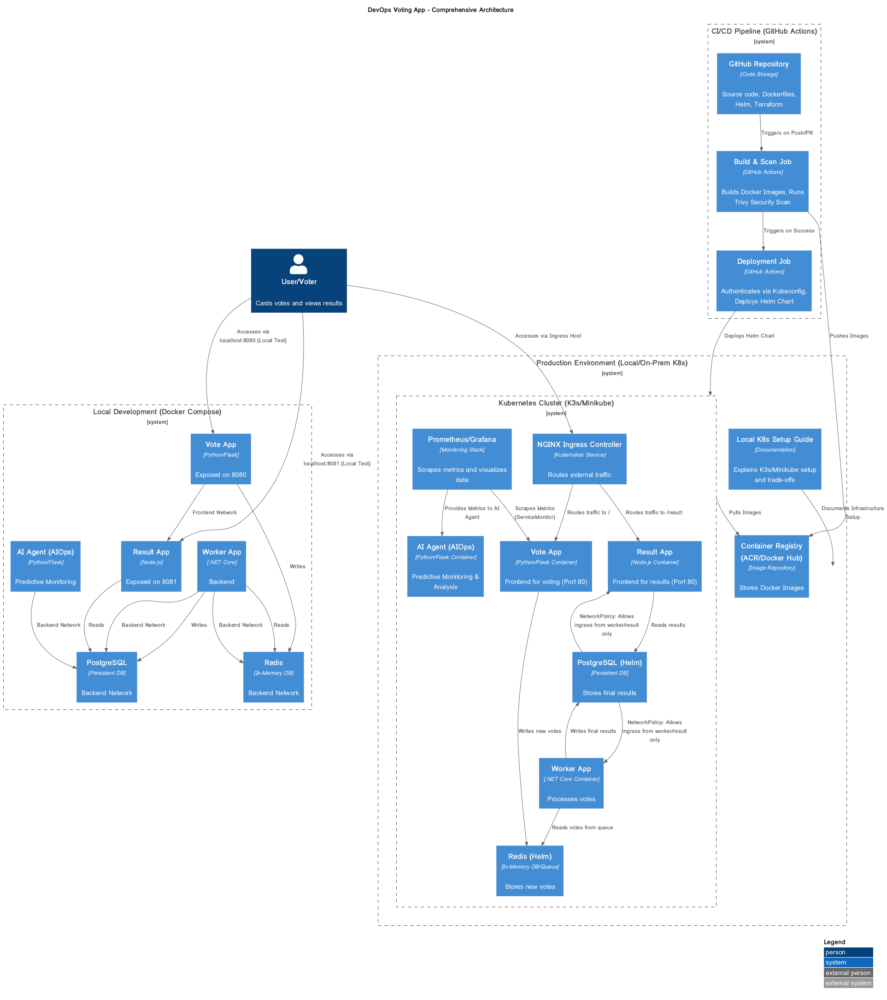

# DevOps Engineer Challenge: Secure, Observable, Scalable Setup (AIOps Enhanced)

## Project Overview

This repository contains the complete solution for the multi-service voting application DevOps challenge, **enhanced with an AI Agent for predictive monitoring (AIOps)**. The project has been refactored to target a **Local Kubernetes Cluster (K3s/Minikube)** instead of Azure AKS, with all necessary documentation and trade-offs provided.

## Application Architecture

### Comprehensive Architecture Diagram (K8s Local Deployment)

The following diagram illustrates the complete DevOps architecture, now targeting a generic Kubernetes cluster.



### Application Components and Data Flow

| Service        | Technology     | Role                                                 | Communication                                           |
| :------------- | :------------- | :--------------------------------------------------- | :------------------------------------------------------ |
| **vote**       | Python (Flask) | Frontend for casting votes.                          | Writes to Redis.                                        |
| **result**     | Node.js (Express) | Frontend for displaying real-time results.           | Reads from PostgreSQL.                                  |
| **worker**     | .NET Core      | Backend worker.                                      | Reads from Redis, Writes to PostgreSQL.                 |
| **ai-monitor** | Python (Flask) | **AI Agent (AIOps)**.                                | Consumes metrics/logs, performs predictive analysis.    |
| **redis**      | Redis          | Message broker/Queue.                                | Used by `vote` and `worker`.                            |
| **postgres**   | PostgreSQL     | Persistent database.                                 | Used by `worker` and `result`.                          |

The data flow is: **Vote App** -> **Redis** -> **Worker** -> **PostgreSQL** -> **Result App**. The **AI Agent** monitors all services for predictive analysis.

---

## Local Setup and Verification (For Screenshots)

To run the application locally, including the new AI Agent, follow these steps:

### Prerequisites

*   **Docker** and **Docker Compose** installed on your machine.

### Step 1: Start the Application

```bash
# This command builds all images and starts all services
docker compose up --build -d
```

### Step 2: Verify Service Health

```bash
docker compose ps
```
All services, including the new `ai-monitor`, should show a status of `running` or `Up (healthy)`.

### Step 3: Access the Applications

1.  **Voting Interface:** `http://localhost:8080`
2.  **Results Interface:** `http://localhost:8081`

### Step 4: Test the AI Agent (Simulation)

The AI Agent runs an API endpoint at `http://localhost:5001`. You can send a POST request to its `/analyze` endpoint to simulate a prediction:

```bash
curl -X POST -H "Content-Type: application/json" -d '{"source":"manual_test"}' http://localhost:5001/analyze
```

Check the logs of the `ai-monitor` service to see the prediction output:

```bash
docker compose logs ai-monitor
```

### Step 5: Stop and Clean Up

```bash
docker compose down
```

---

## Phase 2: Infrastructure & Deployment (Local K8s & Helm)

### 1. Infrastructure as Code (IaC) - Local Kubernetes Setup

Due to the constraint of not having access to an Azure subscription, the deployment target has been shifted from Azure Kubernetes Service (AKS) to a **Local Kubernetes Cluster** (e.g., K3s, Minikube, or Kind).

The `terraform/local-k8s-setup.md` file details the necessary steps for setting up the local cluster and documents the trade-offs as required by the mission.

#### Deployment Trade-Offs (Local Cluster vs. Azure AKS)

The shift from a managed cloud service (AKS) to a local cluster (K3s/Minikube) introduces several significant trade-offs that are documented here:

| Feature | Azure AKS (Managed Cloud) | Local K3s/Minikube (Local Cluster) | Trade-Off / Impact |
| :--- | :--- | :--- | :--- |
| **Infrastructure Provisioning** | **Terraform** for full automation of VNet, Subnets, Load Balancers, and AKS control plane. | **Manual setup** (shell scripts/CLI) for the cluster itself. No cloud networking automation. | **Loss of IaC scope:** IaC is now limited to *simulating* the cluster setup, not provisioning the underlying infrastructure. |
| **Control Plane Management** | **Fully Managed** by Azure. High availability, patching, and upgrades are handled automatically. | **Self-Managed.** User is responsible for cluster maintenance, upgrades, and ensuring uptime. | **Increased Operational Overhead:** Requires manual intervention for cluster health. |
| **Networking & Load Balancing** | **Azure Load Balancer** and **Azure CNI** for robust, scalable networking and external IP allocation. | **NodePort/HostPort** or a simple local Ingress Controller (Traefik/Nginx). External access is limited to the local machine. | **Limited Scalability & External Access:** Cannot handle production-level traffic or provide global access. |
| **Security & Compliance** | Integrated with **Azure AD, Key Vault, Azure Policy,** and robust RBAC. | Relies on **basic Kubernetes RBAC** and local machine security. No integrated cloud security services. | **Reduced Security Posture:** Missing enterprise-grade security features and compliance certifications. |
| **Cost** | Pay-as-you-go model. | Free (zero cost for the cluster itself). | **Cost Saving:** Excellent for development and testing environments. |

### 2. Kubernetes Deployment - Helm Chart (Production-Grade)

The `helm/voting-app` directory contains a production-grade Helm chart that remains portable to any Kubernetes environment.

| Component | Implementation Detail | Security/Best Practice |
| :--- | :--- | :--- |
| **Deployment** | Templates for all services, including the **`ai-monitor`**. | **Resource Limits/Requests** and **Liveness/Readiness Probes** for stability. |
| **Configuration** | Uses **Kubernetes Secrets** (referenced via `secretKeyRef`) for database credentials. | **Production-grade Secrets practice** (never hardcoded). |
| **NetworkPolicy** | `networkpolicy.yaml` template. | **Isolates the database** by only allowing ingress traffic from the `worker`, `result`, and `ai-monitor` pods. |
| **Pod Security** | Defined in `values.yaml`. | Enforces **Pod Security Admission (PSA)** best practices: `runAsNonRoot: true`, `allowPrivilegeEscalation: false`, and dropping all capabilities. |

---

## Phase 3: Automation, Security & Observability

### 1. CI/CD Pipeline - GitHub Actions (Docker Hub & K8s Portable)

The `.github/workflows/main.yml` file defines the automated CI/CD pipeline, now adapted for generic Kubernetes deployment and **Docker Hub** as the registry.

| Stage | Action | Key Feature |
| :--- | :--- | :--- |
| **Build & Scan** | Builds Docker images, scans for vulnerabilities, and pushes to **Docker Hub**. | Includes the **`ai-monitor`** service. Uses **Trivy** for mandatory **Security Scan (SAST)**. |
| **Deploy** | Authenticates to the cluster using a **`KUBE_CONFIG` Secret** and deploys the Helm Chart. | **Portable Deployment:** Removes Azure-specific steps, making the pipeline deployable to any K8s cluster (K3s, Minikube, GKE, EKS, etc.). |

### 2. Observability - Prometheus & Grafana

The `monitoring` directory contains an example **ServiceMonitor** manifest, demonstrating the pattern for integrating the application with a standard Prometheus/Grafana stack.

---

## Repository Contents

```
.
├── .github/
│   └── workflows/
│       └── main.yml           # CI/CD Pipeline (Docker Hub & K8s Portable)
├── docker-compose.yml         # Local Orchestration
├── k8s-manifests/             # Sample K8s Manifests for DB (Documentation)
├── helm/
│   └── voting-app/            # Production-Grade Helm Chart
├── monitoring/
│   └── servicemonitor-vote.yaml # Prometheus ServiceMonitor Example
├── terraform/
│   └── local-k8s-setup.md     # IaC Replacement: K8s Setup Guide & Trade-Offs
├── vote/
├── result/
├── worker/
├── ai-monitor/                # AI Agent Service (AIOps)
├── seed-data/
├── architecture.png           # Updated Architecture Diagram
└── README.md                  # Comprehensive Project Documentation
```
